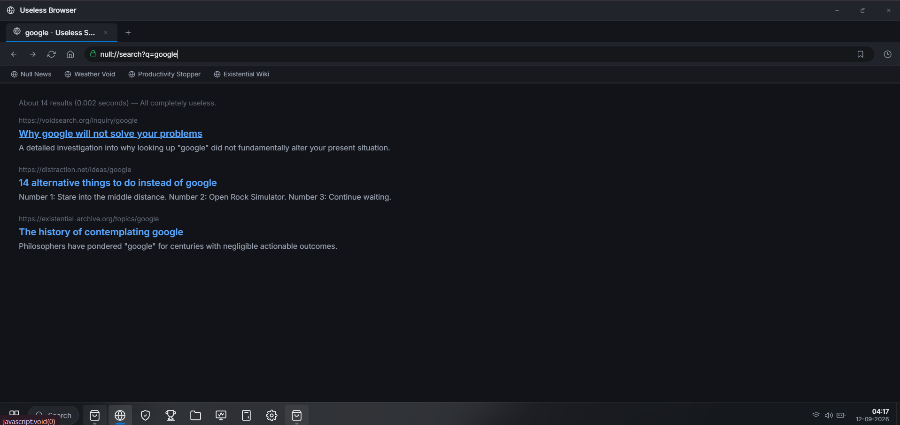
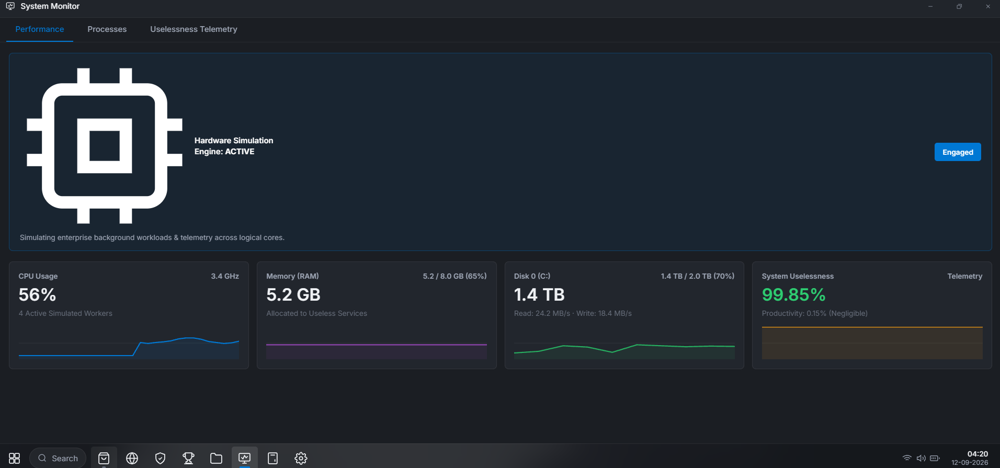

# Null OS 🎯


## Basic Details
### Team Name: AIZEN


### Team Members
- Team Lead: [Amarthyan s s] - [SNMIMT]
- Member 1: [Amarthyan s s] - [SNMIMT]
- Member 2: [Suryakrishna T U] - [SNMIMT]

### Project Description
Null Launcher (NullOS) is a high-fidelity, satirical desktop operating system simulation crafted with modern glassmorphism aesthetics, a multi-tasking window manager, procedural audio synthesis, a real-time uselessness telemetry engine, an extensible developer platform, and a sprawling ecosystem of purposefully useless applications. It delivers the authentic look and feel of an enterprise workstation OS—complete with a login screen, security center, system monitor, interactive developer console, application permissions subsystem, and hardware stress testing suite—dedicated entirely to wasting time with unmatched style.

### The Problem (that doesn't exist)
Modern operating systems are burdened with excessive productivity tools, workflow optimizations, and focus features that relentlessly distract humans from the fine art of doing absolutely nothing. Society was in desperate need of an operating system engineered specifically to guarantee 0% productivity while consuming actual compute resources to do nothing with maximum corporate elegance.

### The Solution (that nobody asked for)
Null Launcher provides a revolutionary desktop experience where users can authenticate into a corporate workstation, manage multi-window desktop workflows, browse an App Store of 20+ completely useless apps (like Rock Simulator, Mouse Tester, and Air Manager), track their asymptotic Uselessness Score (99.99%), trigger procedural audio feedback, and spin up an actual multi-threaded hardware stress engine that pins 500 MB of physical RAM and taxes CPU cores—just to achieve peak inefficiency.

## Technical Details
### Technologies/Components Used
For Software:
- Languages: JavaScript (ES6+), C#, PowerShell, Bash, HTML5, CSS3
- Frameworks: Electron (Desktop Shell)
- Libraries: Web Audio API (real-time procedural audio synthesis, 0 external audio files)
- Tools: Vite 6, npm, Electron Packager, Git

For Hardware:
- Main Components: Any modern PC / Laptop workstation (x86/x64 architecture)
- Specifications: Multi-core CPU, 500 MB+ RAM for the native hardware stress engine
- Tools Required: Modern Web Browser (Chrome, Edge, Firefox) or Windows Desktop Environment

### Implementation
For Software:

# Installation
```bash
# Clone the repository
git clone https://github.com/amarthyan/command.git
cd command

# Install dependencies
npm install
```

# Run
```bash
# Option 1: Run as Web Application (Dev Mode)
npm run dev

# Option 2: Run as Desktop Application (Electron)
npm start

# Option 3: One-Click Desktop Launcher (Windows - with Hardware Stress Engine)
Launch_NullOS.bat
```

### Project Documentation
For Software:

# Screenshots (Add at least 3)

*NullOS Desktop Environment featuring custom wallpaper, Start Menu, Taskbar, and Glassmorphism UI*


*NullOS browser and Search result*


*NullOS task manager and system monitor*

# Diagrams
```
┌──────────────────────────────────────────────────────────┐
│                   NullOS Desktop Shell                   │
│   (Lock Screen / Auth / Start Menu / Taskbar / Windows)  │
└────────────────────────────┬─────────────────────────────┘
                             │
       ┌─────────────────────┼─────────────────────┐
       ▼                     ▼                     ▼
┌──────────────┐      ┌──────────────┐      ┌──────────────┐
│  Uselessness │      │   Web Audio  │      │  App Store   │
│   Telemetry  │      │  Procedural  │      │ & Permission │
│    Engine    │      │  Synthesizer │      │  Subsystem   │
└──────┬───────┘      └──────────────┘      └──────────────┘
       │
       ▼
┌──────────────────────────────────────────────────────────┐
│             Real Hardware Stress Engine                  │
│  (Multi-threaded CPU Worker Threads & 500 MB RAM Buffer) │
└──────────────────────────────────────────────────────────┘
```
*Architecture and workflow diagram of Null Launcher desktop subsystems*

For Hardware:

# Schematic & Circuit
*N/A - Null Launcher is a software-based desktop operating system simulation.*

# Build Photos
*N/A - Software-based project.*

### Project Demo
# Video
https://drive.google.com/drive/folders/1ibWwLUHodrVMR9lp3ftEmtPQxsEJMse5?usp=sharing
*Demonstration of Null Launcher boot sequence, window management, App Store, procedural audio chimes, and hardware stress engine*

# Additional Demos
- Web Browser Mode: Run locally via `npm run dev` at `http://localhost:3000`
- Native Executable: `NullOS.exe` (Standalone Windows Launcher)

## Team Contributions
- [Amarthyan s s]: OS architecture, Electron desktop runtime, window manager, procedural Web Audio engine, hardware stress engine, and core apps.
- [Suryakrishna T U]: UI glassmorphism design tokens, App Store catalog design, review ecosystem, and testing.

---
Made with ❤️ at TinkerHub Useless Projects 


